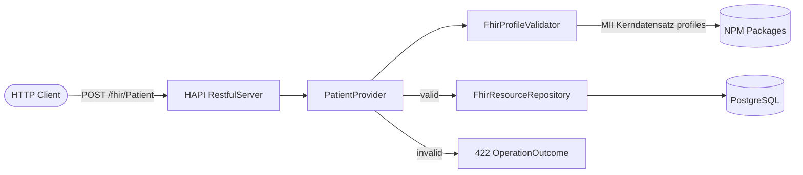

# FHIR MII Pipeline

FHIR R4 REST API with profile validation against the [MII Kerndatensatz](https://www.medizininformatik-initiative.de/de/der-kerndatensatz-der-medizininformatik-initiative) (Core Data Set of the German Medical Informatics Initiative).

Built with Spring Boot and HAPI FHIR plain server — no JPA server, no heavy abstractions. Incoming resources are validated against bundled MII StructureDefinitions before being persisted as raw FHIR JSON in PostgreSQL.

## Architecture



## Tech Stack

- Java 21, Spring Boot 3.4, Maven
- HAPI FHIR 7.6 (`RestfulServer` with `IResourceProvider`)
- MII Kerndatensatz Person profile validation via `NpmPackageValidationSupport`
- PostgreSQL 16 (JSONB storage)
- Docker + docker-compose

## Quick Start

```bash
docker-compose up --build
```

The API will be available at `http://localhost:8080/fhir`.

## API Examples

### Create a valid Patient (MII profile)

```bash
curl -s -w "\n%{http_code}" -X POST http://localhost:8080/fhir/Patient \
  -H "Content-Type: application/fhir+json" \
  -d '{
    "resourceType": "Patient",
    "meta": {
      "profile": [
        "https://www.medizininformatik-initiative.de/fhir/core/modul-person/StructureDefinition/Patient"
      ]
    },
    "identifier": [{
      "type": { "coding": [{ "system": "http://fhir.de/CodeSystem/identifier-type-de-basis", "code": "GKV" }] },
      "system": "http://fhir.de/sid/gkv/kvid-10",
      "value": "A123456789",
      "assigner": { "identifier": { "system": "http://fhir.de/sid/arge-ik/iknr", "value": "109500969" } }
    }],
    "name": [{ "family": "Mustermann", "given": ["Erika"] }],
    "gender": "female",
    "birthDate": "1964-08-12"
  }'
# Expected: 201 Created
```

### Create an invalid Patient (missing required identifier)

```bash
curl -s -w "\n%{http_code}" -X POST http://localhost:8080/fhir/Patient \
  -H "Content-Type: application/fhir+json" \
  -d '{
    "resourceType": "Patient",
    "name": [{ "family": "Fehler", "given": ["Max"] }],
    "gender": "male",
    "birthDate": "1990-01-15"
  }'
# Expected: 422 Unprocessable Entity with OperationOutcome
```

### Read a Patient by ID

```bash
curl -s http://localhost:8080/fhir/Patient/{id}
# Expected: 200 OK with Patient resource
```

## Development

```bash
mvn compile          # compile
mvn test             # run all tests (uses H2, no PostgreSQL needed)
mvn package          # build JAR
```

## Project Structure

```
com.alekseidudchenko.fhirmiipipeline
  ├── config/        FhirContext bean, RestfulServer servlet registration
  ├── resource/      FHIR resource providers (Patient, Observation)
  ├── validation/    Profile validator (MII Kerndatensatz)
  └── persistence/   JDBC repository (JSONB storage)
```

## Roadmap

- [ ] Condition resource provider with MII Diagnose profile
- [ ] Search parameters (name, identifier, date)
- [ ] Pagination support
- [ ] Audit logging
- [ ] OpenAPI / capability statement documentation
